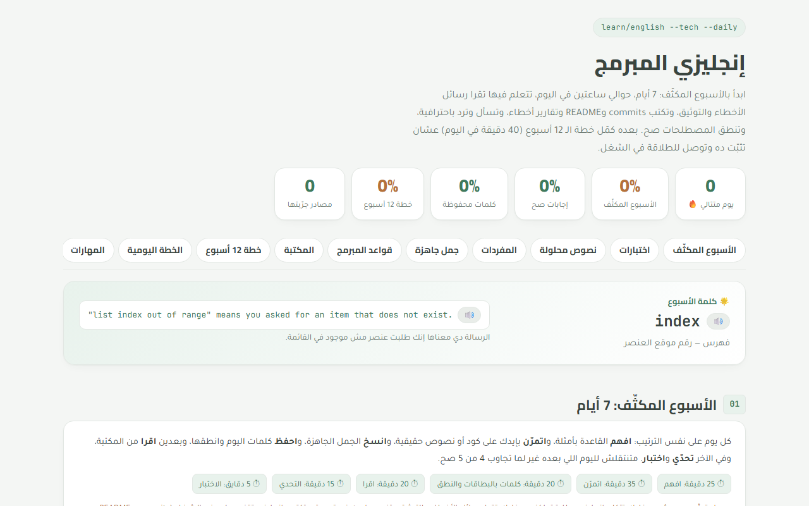

# إنجليزي المبرمج · Programmer English

**The English a developer uses every day — error messages, docs, commits, code review, emails and interviews.**

&nbsp;

&nbsp;

صفحة واحدة لتعلم الإنجليزي اللي المبرمج بيحتاجه كل يوم: رسائل الأخطاء، والتوثيق، والكتابة التقنية، والتواصل، والمقابلات.

**الموقع:** https://micro4tricks-ai.github.io/programmer-english/

## فيها إيه
- **الأسبوع المكثّف**: 7 أيام، كل يوم فيه شرح وتمارين وقوالب وكلمات وتحدي واختبار.
- **اختبارات**: أسئلة كل يوم، و«مراجعة شاملة» على الاختصارات وأكواد HTTP وGit والقواعد، وتبويب للأسئلة اللي غلطت فيها.
- **نصوص محلولة (20)**: Tracebacks، وأخطاء JavaScript وGit، وتوثيق، وREADME، وbug reports، وcode review، ووصف PR، وrelease notes، وpost-mortem، وإيميلات، وحوارات (standup، مقابلة، مكالمة عميل).
- **بنك مفردات (+430 كلمة)** بالنطق والبطاقات، ومنها اختصارات الشغل (LGTM، ASAP، WIP…)، والـ Phrasal verbs، والذكاء الاصطناعي، وDevOps، والأمان، وJavaScript، وn8n، والاجتماعات.
- **جمل جاهزة** لكل موقف: code review، ووصف PR، والتقدير والمواعيد، والعروض، والتفاوض، والمقابلات.
- **قواعد المبرمج** بمثال صح ومثال غلط لكل قاعدة.
- **رسائل الأخطاء**: Python وJavaScript وGit والـ Terminal، وأكواد HTTP، ولكل رسالة المعنى والسبب والحل.
- **المكتبة**: حوالي 150 مصدر، مع بحث وفلاتر (مجاني، عربي، مفضّل) واقتراح عشوائي.
- **خطة 12 أسبوع** يومية، ومهارات، ومشاريع.
- **المراجع**: المصادر اللي اتبنى عليها المحتوى، بروابطها الأصلية.
- التقدم بيتحفظ في المتصفح، وينفع تنقله لجهاز تاني بـ«كود التقدم».

## النشر
الموقع ملف واحد (`index.html`) منشور بـ GitHub Pages من الفرع `main` والفولدر `/ (root)`. أي تعديل يترفع على `main` بيظهر على الموقع بعد دقيقة تقريبًا.
